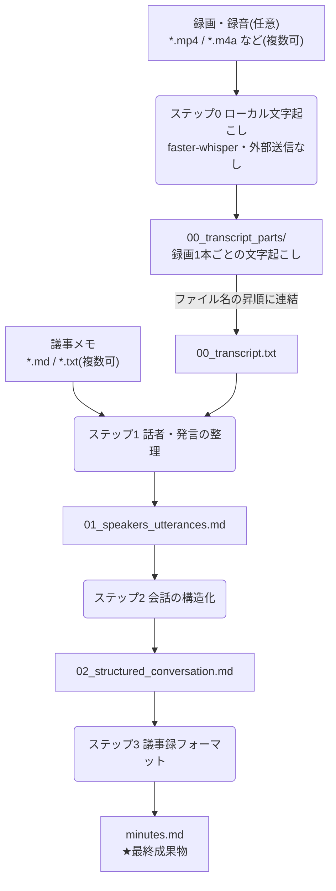

# meeting-minutes-generator

会議の議事メモ・録画から議事録(Markdown)を自動生成するアプリケーション。

- **はじめて使う方**:[`docs/getting-started.md`](docs/getting-started.md)(しくみ・最短手順・機密情報の取り扱い・利用料金の試算)
- 仕様:[`docs/requirements.md`](docs/requirements.md)(要件定義書)
- 設計:[`docs/design.md`](docs/design.md)(設計書ハブ)+ [`docs/design/`](docs/design/)(分冊)
- 実装計画:[`docs/implementation-plan.md`](docs/implementation-plan.md)

---

## 全体の流れ

入力は `inputs/{project}/{date}/`、出力は `outputs/{project}/{date}/` に置かれる。



- 音声・動画の文字起こしは**ローカル**(`faster-whisper`)で完結し、外部へ送信しない。Claude に渡すのはテキスト化後のデータのみ。
- **同一会議の議事メモ・録画はどちらも複数ファイル置ける。** メモは全件がステップ1の入力になり、録画は**ファイル名の昇順**に文字起こしして連結される(会議を中断・再開して録画が分割された場合など)。
- 各ステップは前段の出力ファイルを入力に取る独立処理なので、**途中のステップだけ再実行できる**。
- `inputs/` と `outputs/` は **Git 管理外**(会議内容を含むため)。`projects/` 配下も、雛形の `_template/` と動作確認用の `sample/` を除いて **Git 管理外**(話者名・顧客名を含むため)。

## 事前準備

1. 実行環境を用意する。

   - **GitHub Codespaces / devcontainer**:`postCreate.sh` が依存パッケージを導入済みなので追加作業は不要。
   - **ローカル環境**:「ローカル環境のセットアップ」節を先に実施する。

2. 認証を設定する(「認証のセットアップ」節)。Bedrock の場合は SSO ログインも行う。

3. プロジェクトを作る(雛形をコピーして自分の会議に合わせて編集する)。

   ```bash
   cp -r projects/_template projects/<プロジェクト名>
   ```

   `projects/<プロジェクト名>/config.yaml` に話者・会社・議事録の見出し構成を書く。議事録の書き方そのものを変えたい場合は同ディレクトリの `prompts/*.md` を編集する(**`CLAUDE.md` はパイプライン実行時には適用されない**)。

   コピーして作ったディレクトリは **Git 管理外**なので実名を書いて構わないが、その分リポジトリ経由では同期されない。別の環境でも使う場合は各自で複製する。`_template/` 側を改善した場合は、既存プロジェクトへの反映も手作業になる。

## ローカル環境のセットアップ(Codespaces を使わない場合)

devcontainer / Codespaces では `postCreate.sh` が導入済みなので、この節は不要。**GPU は前提としない**(文字起こしは CPU 動作。CPU 4コア相当を推奨)。

| 必要なもの | 用途 | 必要になる条件 |
|---|---|---|
| Python 3.12 以上 + pip | 文字起こし(`faster-whisper`)の実行 | 常に必要 |
| ffmpeg | 音声・動画の読み込み(`faster-whisper` の前提) | 録音・録画を入力にする場合 |
| Node.js **22 以上** + npm | `@anthropic-ai/claude-code`(`claude` コマンド)の導入 | 常に必要 |
| AWS CLI v2 | `aws_sso_login.sh` の SSO ログイン | **Bedrock 経路のみ** |
| gcloud CLI | Vertex AI の認証情報取得 | **Vertex AI 経路のみ** |
| shellcheck / shfmt / bats | Bash の Lint / Format / Test | **開発する場合のみ**(「開発」節) |

`jq` / `yq` は不要(設定ファイルの読み取りに外部の YAML パーサを使わない設計)。

**Bash は macOS 標準の 3.2 で動く**ため、パイプラインを実行するだけなら `bash` の追加インストールは不要([`docs/design/01-conventions.md`](docs/design/01-conventions.md) §8)。ただし **macOS で `bats` を実行する場合のみ** Bash 5 が必要になる(「開発」節)。

### 1. OS パッケージを入れる

**macOS(Homebrew)**

```bash
brew install python@3.13 ffmpeg node
brew install shellcheck shfmt bats-core   # 開発する場合のみ
```

**Ubuntu / Debian(apt)**

```bash
sudo apt-get update
sudo apt-get install -y --no-install-recommends python3 python3-pip python3-venv ffmpeg
sudo apt-get install -y --no-install-recommends shellcheck shfmt bats   # 開発する場合のみ
```

Node.js は **apt の `nodejs`(24.04 では 18 系)では要件を満たせない**ため、22 以上を別途入れる(下記)。ffmpeg・shellcheck・shfmt・bats は apt のもので devcontainer と同じ構成になる。`shfmt` は npm 版を使わない(実体を含まないため)。

```bash
# nvm で Node.js の LTS を入れる例(nvm のバージョンは公式リポジトリで最新を確認する)
curl -o- https://raw.githubusercontent.com/nvm-sh/nvm/v0.40.6/install.sh | bash
exec "$SHELL" -l
nvm install --lts
```

**Windows(WSL2 上の Ubuntu)**

- パッケージ導入は上の **Ubuntu / Debian** の手順を WSL2 の Ubuntu 内でそのまま実行する(Windows 側に ffmpeg 等を入れる必要はない)。
- リポジトリは **WSL 側のファイルシステム**(例:`~/src/meeting-minutes-generator`)に置き、`git clone` も WSL 内で行う。`/mnt/c/...` は I/O が遅く、改行コード・実行権限の扱いでスクリプトが動かないことがある。
- 録画・音声は Windows 側からコピーして使う。

  ```bash
  cp /mnt/c/Users/<ユーザー名>/Videos/<録画>.mp4 inputs/<プロジェクト名>/2026-08-17/
  ```

- ブラウザ認証(`aws sso login` 等)で WSL からブラウザが開かない場合は、ターミナルに表示されたURLと確認コードを Windows 側のブラウザで開く(Codespaces と同じ流れ。「Bedrock を使う場合の SSO ログイン」節を参照)。

### 2. Python 依存パッケージを入れる

仮想環境を作って入れる(OS の Python を変更しない。`.venv/` は **Git 管理外**)。

```bash
python3 -m venv .venv
source .venv/bin/activate
pip install -r requirements.txt        # 実行用(faster-whisper 等)
pip install -r requirements-dev.txt    # 開発用(pytest / ruff / black 等)
```

- `./scripts/generate_minutes.sh` は `python3` を PATH から解決するため、**仮想環境を有効化したシェルで実行する**(有効化を忘れると文字起こしが `faster-whisper` 未検出で失敗する)。
- Ubuntu 24.04 / Homebrew の Python は外部管理環境のため、仮想環境を使わない `pip install` は拒否されることがある。

### 3. Claude Code CLI を入れる

```bash
npm install -g @anthropic-ai/claude-code
claude --version
```

Node.js が 22 未満だとインストールに失敗する(`node --version` で確認する)。

### 4. 認証経路ごとの CLI を入れる

必要なものは経路によって変わる。どの経路を使うかは次節で決める。

**Amazon Bedrock 経由の場合:AWS CLI v2**

AWS 公式のインストールスクリプトを使う(macOS / Linux 共通。既定で `$HOME/.local` 配下に入るため sudo 不要)。Ubuntu の apt には `awscli` パッケージが無いので apt では入らない。

```bash
curl -fsSL https://awscli.amazonaws.com/v2/install.sh | bash
aws --version
```

**Anthropic の商用APIキーの場合:追加の CLI は不要**

**Google Cloud Vertex AI 経由の場合:gcloud CLI**

Debian / Ubuntu では apt リポジトリを追加して `google-cloud-cli` パッケージを入れる。macOS では公式配布物を展開して `install.sh` を実行する。手順は [Google Cloud CLI のインストール](https://docs.cloud.google.com/sdk/docs/install)を参照。導入後、認証情報を取得しておく。

```bash
gcloud auth application-default login
```

ここまで終わったら次節に進む。

## 認証のセットアップ

認証値は `config/auth/active.env` に置く(**Git 管理外**)。利用する経路のテンプレートをコピーして値を書き換える。

```bash
# Amazon Bedrock 経由で使う場合
cp config/auth/bedrock.env.example config/auth/active.env

# Anthropic の商用APIキーを使う場合
cp config/auth/anthropic-api.env.example config/auth/active.env

# Google Cloud Vertex AI 経由で使う場合
cp config/auth/vertex.env.example config/auth/active.env
```

- `ANTHROPIC_MODEL` は**どの経路でも必須**。エイリアス(`sonnet` 等)ではなく、モデルID / 推論プロファイルIDを明示的に指定する。
- ステップごとに違うモデルを使いたい場合は `ANTHROPIC_MODEL_STEP1` / `ANTHROPIC_MODEL_STEP2` / `ANTHROPIC_MODEL_STEP3` を設定する(未設定のステップは `ANTHROPIC_MODEL` にフォールバックする)。機械的な発言整理が主のステップ1を軽量モデルに振ると所要時間とコストを下げられる。各テンプレートにコメントアウトした記述例がある。
- `active.env` が存在すればその値が使われ、存在しなければ既存の環境変数(Codespaces Secrets 由来など)がそのまま使われる。
- APIキー等の機密値は、Codespaces では `active.env` に書かず **Secrets 経由の環境変数**で渡すことを推奨する。`active.env` にはプロファイル名・リージョン等の非機密値のみを書く運用を基本とする。
- Vertex AI 経路では、`active.env` に GCP の認証情報そのものを書かず、事前に `gcloud auth application-default login` で取得しておく(テンプレート冒頭に記載)。

詳細は [`docs/design/04-auth.md`](docs/design/04-auth.md) を参照。

## Bedrock を使う場合の SSO ログイン

```bash
./scripts/aws_sso_login.sh
```

- 引数はなく、`AWS_PROFILE` は `config/auth/active.env`(または環境変数)から読み込む。
- **既存の SSO セッションが有効な場合は再ログインしない**(毎回ブラウザ確認が発生するのを防ぐため)。
- SSO プロファイルが未作成の場合は、先に `aws configure sso --profile <プロファイル名>` で作成する。
- **Codespaces などのヘッドレス環境**では、`aws sso login` が認証用URLと確認コードをターミナルに表示する。**初回認証はローカルPCのブラウザでそのURLを開いて**コードを入力する必要がある(Codespace 内にブラウザは無い)。
- このスクリプトは Bedrock 利用時(`CLAUDE_CODE_USE_BEDROCK=1`)にのみ必要で、他の認証経路では実行不要。

## 議事録を生成する

1. 入力を置く(どちらか一方でよい。両方あれば文字起こしを一次情報、メモを話者特定に使う)。

   ```bash
   mkdir -p inputs/<プロジェクト名>/2026-08-17
   cp <議事メモ>   inputs/<プロジェクト名>/2026-08-17/   # .md / .txt。ファイル名は任意
   cp <録画・録音>  inputs/<プロジェクト名>/2026-08-17/   # mp4/m4a/mp3/wav/mov/webm/aac/flac
   ```

   同一会議に対して**複数のメモ・複数の録画を置いてよい**(自動生成メモ+手書きメモ、中断・再開で分割された録画など)。分割録画は**ファイル名の昇順が会議の時系列順**になるように命名する(例:`recording_1.mp4` / `recording_2.mp4`)。連結順は実行時の進捗出力に表示されるので、実行前に `--dry-run` で確認できる。

   `inputs/` に置いた `.md` / `.txt` は**すべて議事メモとして扱われる**。他ツールで作った文字起こしテキストを使いたい場合は、`inputs/` ではなく `outputs/<プロジェクト名>/2026-08-17/00_transcript.txt` に置く(こうすると文字起こしがスキップされ、一次情報として扱われる)。`inputs/` 側にも同じ内容を残すと**メモと文字起こしの二重添付**になり、入力が無駄に倍増するので置かない。

2. 実行する。

   ```bash
   ./scripts/generate_minutes.sh <プロジェクト名> 2026-08-17
   ```

   結果は `outputs/<プロジェクト名>/2026-08-17/minutes.md` に出る。中間生成物3ファイルも同じディレクトリに残る。

### よく使うオプション

| コマンド | 用途 |
|---|---|
| `--dry-run` | 何も実行せず実行計画のみ表示(`claude` / 文字起こし / SSO ログインを呼ばない) |
| `--from-step 2` | ステップ2から最後まで再実行(ステップ1の出力を手直しした後など) |
| `--only-step 3` | 議事録の体裁だけ作り直す(`prompts/03_format.md` を調整したとき) |
| `--only-step 0` | 文字起こしのみ実行 |
| `--model-size small` | 文字起こしの精度を上げる(既定 `base`。`tiny`/`base`/`small`/`medium`/`large-v3`) |
| `--parallel 4` | ステップ1・2を分割して並列実行し、所要時間を短縮する(既定 `1` = 分割しない。`1`〜`8`) |

- `00_transcript.txt` が既にあれば文字起こしはスキップされる(作り直す場合はファイルを削除する)。
- 録画を後から追加した場合は `00_transcript.txt` を削除して再実行する。`00_transcript_parts/` に録画ごとの結果が残っているため、**追加分だけが文字起こしされる**(既存分は再実行されない)。特定の録画を取り直したい場合は、そのパートファイルも削除する。
- 途中のステップだけ再実行すると後段の出力が古くなるため、`WARN` と再生成コマンドの案内が出る。
- 実行中は60秒ごとに `ステップ1 実行中 (経過 3分)` が表示される。間隔は `HEARTBEAT_INTERVAL_SECONDS` で変更でき、`0` で無効になる。
- 終了コード:`0` 正常 / `1` 想定内のエラー(入力不足など) / `2` 認証エラー / `3` 外部コマンド失敗 / `130` 中断(Ctrl+C)。
- 失敗した場合は `claude` の出力が `*.error.log` に残る(下記「実行が失敗したとき」)。

### 長い会議の実行時間を短縮する(`--parallel`)

長時間の会議(数時間の録画・十万字規模の文字起こし)では、ステップ1・2が発言をすべて書き直すため単発実行では10〜20分以上かかる。律速は入力量ではなく**出力の逐次生成**なので、`--parallel N` で入力を N 分割して**並列に実行する**ことで所要時間をおよそ 1/N に短縮できる。

```bash
./scripts/generate_minutes.sh <プロジェクト名> 2026-08-17 --parallel 4
```

- **まずは 4 程度から試す。** 上限は 8。Bedrock 経由では並列度を上げるとスロットリング(`ThrottlingException`)で失敗しやすくなるため、失敗する場合は下げる。既定が `1`(分割しない)なのはこのため。
- 分割対象は1ファイルのみ(`00_transcript.txt` があればそれ、無ければ最大のメモ)。**議事メモは話者の名寄せに必要なため分割せず、全パートに全文を渡す**。実際に選ばれたファイル・パート数・行数は実行時に表示されるので、`--dry-run` で事前に確認できる。
- パート境界の前後 30 行は文脈把握用に隣のパートへ渡され、その範囲は出力しないようプロンプトで指示している。行数は `SPLIT_OVERLAP_LINES` で変更できる。
- パートごとの出力は `01_parts/` `02_parts/` に残る。**失敗したパートだけを再実行できる**(完了済みパートは再実行しない)。`--parallel` の値を変えるとパート分割が変わるため、キャッシュは再利用されない。
- ステップ3(議事録の体裁)は出力が小さく、会議全体を通して見る必要があるため分割しない。
- 分割できない場合(対象ファイルが見つからない、行数がパート数に足りない)は `WARN` を出して単発実行に落ちる。
- 品質面では、チャンク境界での発言の欠落・重複やトピックの分断が起こり得る。生成後に `/minutes-review` で確認することを推奨する。

### 実行が失敗したとき

失敗すると、その回の `claude` の出力が `01_parts/01_part1of4.md.error.log`(単発実行なら `01_speakers_utterances.md.error.log`)に残る。**まずこのファイルを見る。** エラーメッセージ本体はここにしか出ない。

よくある内容:

```
API Error: Claude's response exceeded the 32000 output token maximum.
```

1回の呼び出しが返せる出力量の上限に達している。ステップ1・2は発言をすべて書き直すため、長い会議では単発実行でも粗い分割でも上限に当たる。対処は次のどちらか。

- **`--parallel` を増やして1パートを小さくする**(推奨。所要時間の短縮にもなる)
- `CLAUDE_CODE_MAX_OUTPUT_TOKENS=64000` を `config/auth/active.env` に設定して上限を上げる

上限付近では同じパートが成功する回と失敗する回がある(生成の長さが揺れるため)。完了済みのパートは残るので、そのまま同じコマンドで再実行すれば未完了のパートだけが実行される。

### 「出力の先頭が契約と一致しません」で止まったとき

```
ERROR: 出力の先頭が契約と一致しません(step 3)。生成物は確定していません。
```

1回の応答が出力上限に達すると `claude` は自動的に続きを生成するが、`-p`(非対話)が返すのは**最後の応答だけ**なので、それより前に生成された内容が失われる。**この経路は API エラーにならず終了コード `0` で返る**ため、スクリプトは各ステップの出力の1行目(ステップ1・2は見出しか箇条書き、ステップ3は `# 議事録:`)を検証し、一致しなければ失敗として停止する([`docs/design/09-decisions.md`](docs/design/09-decisions.md) §6.5)。既存の成果物は上書きされない。

残った後半部分は `minutes.md.truncated.md`(パートなら `01_parts/01_part2of4.md.truncated.md`)に退避される。**`.error.log` と違いこれは出力の一部**なので、内容を確認したうえで、再実行前に消す必要はない(成功すれば自動的に消える)。

対処は**1回の呼び出しに要求する出力量を減らす**こと。

- **`CLAUDE_CODE_DISABLE_THINKING=1` を `config/auth/active.env` に設定する(最も効く)。** thinking は出力トークン上限を本文と共有するため、思考が長引くと本文の予算が減り、自動継続が起きる。実測では本文を1文字も出さない応答が2回発生してステップ3に41分かかっていたが、この設定で**同じ入力が1分52秒で完了し、自動継続も起きなくなった**([`docs/design/09-decisions.md`](docs/design/09-decisions.md) §6.6)。本アプリのステップ1〜3は規則に沿った書き換え・整形が主で長い思考を要さない。なお `MAX_THINKING_TOKENS` は実測で効果が確認できなかった。
- ステップ1・2は `--parallel` を増やす。
- ステップ3(`minutes.md`)は会議全体を1回で読む必要があるため分割しない。`projects/<プロジェクト名>/config.yaml` の `minutes_sections` に**全発言を再掲するセクション(「詳細な議事録」等)を入れない**。これはステップ3の出力の大半(実測で69%)を占める。議論の経過は `02_structured_conversation.md` を参照する運用が既定である。

`--only-step 3` で作り直せば、ステップ1・2をやり直さずに済む。

なお `Warning: Opus: Opus 5 not available — using ...` が出ることがあるが、これは `claude` CLI のセッション既定モデルに関する表示で、**実際のリクエストには `ANTHROPIC_MODEL` で指定したモデルが使われる**(スクリプトが `--model` で明示的に渡している)。無視してよい。

### 生成後のレビュー

対話モードの Claude Code で、元インプット・中間生成物・議事録を突き合わせたレビューを実行できる。

```
/minutes-review <プロジェクト名> 2026-08-17
```

漏れ / 矛盾 / 要確認の3観点で指摘し、**どのステップで情報が落ちたか**を併記する(議事録は自動修正せず、指摘のみ)。

指摘は画面に表示されるほか、`outputs/<プロジェクト名>/2026-08-17/review_01.md` に保存される(**Git 管理外**)。実行するたびに `review_02.md`, `review_03.md` と連番で増えるので、`--only-step N` で再生成した前後の指摘を比較できる。

---

## 開発

Format / Lint / Test は以下のとおり([`docs/design/07-testing.md`](docs/design/07-testing.md) §5)。ローカル環境では `shellcheck` / `shfmt` / `bats` と開発用の Python 依存を別途入れる(「ローカル環境のセットアップ」節)。

**macOS で `bats` を実行する場合は `brew install bash` が追加で必要。** bats は Bash 3.2(macOS 標準)では日本語のテスト名を解決できず、1件も実行されない。スクリプト側は Bash 3.2 で動くことを保ち(`bats tests/bats` のケース34・34bで検査)、Bash 5 はテストランナーのためだけに入れる。

```bash
# Python
black scripts tests
ruff check scripts tests
pytest tests/python --cov=scripts --cov-report=term-missing

# Bash
shfmt -i 2 -w scripts tests .devcontainer
shellcheck scripts/*.sh .devcontainer/postCreate.sh tests/stubs/claude tests/stubs/aws tests/bats/helper.bash
bats tests/bats
```
