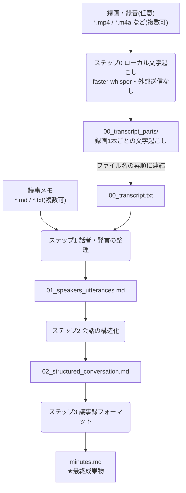

# 会議の録画とメモから議事録を自動生成する — meeting-minutes-generator 入門

会議が終わったあと、録画を見返しながら議事録を書き起こす作業に何時間もかけていないでしょうか。このアプリは、**会議の議事メモと録画を置いて1コマンド実行すると、Markdown の議事録が出てくる**ようにしたものです。文字起こしは手元の PC で完結し、Claude に渡るのはテキストだけなので、機密性の高い会議でも使えるように設計してあります。

## この記事について

- **想定読者**:このリポジトリを受け取って、自分の担当会議で使ってみたい人。ターミナルで `git` や `cd` が使える程度の前提知識があれば読めます。
- **読了目安**:15分程度。急いでいる場合は「3. 最短で動かす」だけ読めば動かせます。
- **この記事の役割**:「何ができるか → どう動いているか → 最短で動かす → 機密は大丈夫か → いくらかかるか」を一度に把握することがゴールです。**環境構築やオプションの網羅的な手順書は [`../README.md`](../README.md) が正**なので、細かいところはそちらへリンクで送ります。仕様の背景は [`requirements.md`](requirements.md)、実装の設計は [`design.md`](design.md) にあります。

> **コマンド例の表記について**
> この記事に出てくる `<プロジェクト名>` や `<プロファイル名>` はプレースホルダです。実際の案件名・顧客名・話者名はご自身の環境で置き換えてください。**そして、それらを書いたファイルは Git 管理外のディレクトリに置かれます**(理由は「機密情報の取り扱い」の節)。設定例として登場する会社名・人名は、リポジトリに同梱されている雛形の架空の値です。

---

## 1. 何ができるのか

入力は2種類あり、**どちらか一方だけでも動きます**。

| 入力 | 置き場所 | 形式 |
|---|---|---|
| 議事メモ | `inputs/<プロジェクト名>/<会議日>/` | `.md` / `.txt`(複数可) |
| 録画・録音 | `inputs/<プロジェクト名>/<会議日>/` | `.mp4` `.m4a` `.mp3` `.wav` `.mov` `.webm` `.aac` `.flac`(複数可) |

出力は `outputs/<プロジェクト名>/<会議日>/` に出ます。



最終成果物は `minutes.md` です。その見出し構成は、プロジェクトごとの設定ファイルに書いた `minutes_sections` がそのまま使われます。雛形の既定値はこうなっています。

```yaml
minutes_sections:
  - 会議概要
  - 決定事項
  - 検討事項(要件・目標値・見積)
  - ToDo(担当者・期限)
  - 懸念事項
  - 次回アクション
```

つまり「議事録のフォーマットは案件ごとに決められる」ということです。ToDo は担当・内容・期限の表として出力されます。

---

## 2. どう動いているのか

### 4つの段階に分かれている

議事メモや文字起こしから、一度に議事録を作ってはいません。段階を分けています。

| ステップ | やること | 出力 |
|---|---|---|
| **0** | 録画・録音をローカルで文字起こし(`faster-whisper`) | `00_transcript.txt` |
| **1** | 話者を特定し、発言を時系列に整理する。フィラー除去・表記ゆれ統一 | `01_speakers_utterances.md` |
| **2** | 発言をトピックに束ね、論点・やり取り・結論の構造にする | `02_structured_conversation.md` |
| **3** | `minutes_sections` の順に議事録として整形する | `minutes.md` |

なぜ分けるのか。理由は2つあります。

1. **部分的に作り直せる。** 各ステップは「前段の出力ファイルを読んで、次のファイルを書く」独立した処理です。議事録の体裁だけ気に入らないなら、ステップ3だけ再実行すれば済みます(`--only-step 3`)。一括処理にしてしまうと、毎回すべてやり直しになります。
2. **一度に詰め込むと精度が落ちる。** 「誰が何を言ったか」「それはどの論点の話か」「議事録としてどうまとめるか」は別種の作業です。段階を分けたほうが各段の指示が単純になり、結果が安定します。

### 1ステップの実体はこれだけ

各ステップは、Claude Code CLI の**たった1回の非対話実行**です。

```bash
claude -p --bare --system-prompt-file <そのステップのプロンプト> --tools "" --model <モデルID>
```

- 入力は **stdin** から流し込み、出力は **stdout** をそのままファイルに落とします。
- `--tools ""` で**Claude が使えるツールをすべて無効化**しています。ファイルを勝手に読むことも、Web にアクセスすることもできません。
- `--bare` と、リポジトリ外の一時ディレクトリで実行することで、`CLAUDE.md` などの開発用ファイルが読み込まれないようにしています(詳しくは機密の節)。

stdin に流す内容はラベル付きのセクションになっています。

```
===== INPUT: PROJECT_CONFIG (config.yaml) =====
project: サンプル案件
...
===== INPUT: MEETING_MEMO (memo.md) =====
...
===== INPUT: TRANSCRIPT (00_transcript.txt) =====
...
===== END OF INPUT =====
```

ステップごとに渡すものが違います。ここが「前段の出力を次段の入力にする」の実体です。

| ステップ | stdin に入るもの |
|---|---|
| 1 | `config.yaml` + 議事メモ**全件** + `00_transcript.txt`(あれば) |
| 2 | `config.yaml` + `01_speakers_utterances.md` |
| 3 | `config.yaml` + `02_structured_conversation.md` |

ステップ2以降は元の録画・メモを見ていない、という点は覚えておくと役に立ちます。議事録に情報が足りないとき、「どの段で落ちたのか」を切り分ける手がかりになります。

---

## 3. 最短で動かす

### 環境

**GitHub Codespaces / devcontainer で開くのがいちばん簡単です。** `postCreate.sh` が `ffmpeg`・`claude` コマンド・Python 依存をすべて入れるので、追加作業はありません。

ローカルで動かす場合は Python 3.12+、ffmpeg、Node.js 22+ が必要です。手順は [`../README.md`](../README.md) の「ローカル環境のセットアップ」節にあります。**ひとつだけ落とし穴**があり、`generate_minutes.sh` は PATH の `python3` を使うため、**仮想環境を有効化したシェルで実行**してください。忘れると文字起こしが `faster-whisper` 未検出で失敗します。GPU は不要です(CPU 4コア相当を推奨)。

### 手順1:認証を設定する

利用する経路のテンプレートをコピーして値を書き換えます。`active.env` は Git 管理外です。

```bash
cp config/auth/bedrock.env.example config/auth/active.env
```

Bedrock 経路の場合、埋めるのは4つです。

```bash
CLAUDE_CODE_USE_BEDROCK=1
AWS_PROFILE=<aws configure sso で作成したプロファイル名>
AWS_REGION=ap-northeast-1
ANTHROPIC_MODEL=<推論プロファイルID または モデルID>
```

`ANTHROPIC_MODEL` は**どの経路でも必須**で、`sonnet` のようなエイリアスは使えません。モデルIDまたは推論プロファイルIDを明示的に固定します(実行するモデルが黙って変わらないようにするためです)。

Bedrock の場合は SSO ログインもしておきます。**セッションが有効なら再ログインしない**ので、毎回叩いても構いません。

```bash
./scripts/aws_sso_login.sh
```

Anthropic の商用APIキーを使う場合は `anthropic-api.env.example` を、Vertex AI の場合は `vertex.env.example` をコピーします。SSO ログインは不要になります。

### 手順2:プロジェクトを作る

案件ごとに1つ作ります。雛形をコピーするだけです。

```bash
cp -r projects/_template projects/<プロジェクト名>
```

`projects/<プロジェクト名>/config.yaml` を自分の会議に合わせて書き換えます。**重要なのは3か所**です。

```yaml
project: サンプル案件

companies:                        # 会社名・略称・立場。表記ゆれを寄せる基準になる
  - name: 株式会社サンプル
    short_name: サンプル社
    role: 顧客

speakers:                         # ★ここが議事録の品質にいちばん効く
  - name: 山田 太郎
    role: 部長
    company: 株式会社サンプル
    aliases: ["山田", "山田さん", "ヤマダ"]

minutes_sections:                 # ★議事録の見出しになる
  - 会議概要
  - 決定事項
  ...
```

`aliases` は**文字起こしに現れうる呼び方を並べる欄**です。文字起こしは「山田さん」「ヤマダ」のように揺れるので、ここに列挙しておくと同一人物として名寄せされます。ここを埋めるかどうかで、ステップ1の出力の読みやすさが大きく変わります。

### 手順3:入力を置いて実行する

```bash
mkdir -p inputs/<プロジェクト名>/2026-08-17
cp <議事メモ>  inputs/<プロジェクト名>/2026-08-17/
cp <録画>      inputs/<プロジェクト名>/2026-08-17/

./scripts/generate_minutes.sh <プロジェクト名> 2026-08-17
```

`outputs/<プロジェクト名>/2026-08-17/minutes.md` ができます。

初回は `--dry-run` を付けると、**何も実行せずに実行計画だけ**が出ます。どのファイルが議事メモ扱いになり、録画がどの順で連結されるかを事前に確認できます。

```bash
./scripts/generate_minutes.sh <プロジェクト名> 2026-08-17 --dry-run
```

覚えておくと便利な点をいくつか。

- **メモも録画も複数置けます。** メモは全件がステップ1の入力になります。録画は**ファイル名の昇順**に文字起こしして連結されるので、中断・再開で分割された録画は `recording_1.mp4` / `recording_2.mp4` のように時系列順の名前にします。
- **他ツールで作った文字起こしを使う**場合は、`inputs/` ではなく `outputs/<プロジェクト名>/2026-08-17/00_transcript.txt` に置きます。こうすると文字起こしがスキップされ、一次情報として扱われます。`inputs/` にも同じものを置くと二重添付になり、入力が無駄に倍増します。
- `00_transcript.txt` が既にあれば文字起こしはスキップされます。録画を後から追加したときは `00_transcript.txt` を削除して再実行すれば、**追加分だけ**が文字起こしされます(録画ごとの結果が `00_transcript_parts/` に残っているため)。

### 手順4:結果をレビューする

生成した議事録は、対話モードの Claude Code でレビューできます。

```
/minutes-review <プロジェクト名> 2026-08-17
```

元の入力・中間生成物・議事録を突き合わせ、**漏れ / 矛盾 / 要確認**の3観点で指摘し、**どのステップで情報が落ちたか**を併記します。議事録を勝手に書き換えることはありません(指摘のみ)。結果は `review_01.md`、`review_02.md` と連番で保存されます。

---

## 4. 生成結果を変えたいとき

編集する場所が2つあります。混同しやすいので押さえてください。

| 変えたいこと | 編集する場所 |
|---|---|
| 誰が話者か、会社名、議事録の見出し構成、文体 | `projects/<プロジェクト名>/config.yaml` |
| **議事録の書き方そのもの**(整理・構造化・整形の指示) | `projects/<プロジェクト名>/prompts/*.md` |

`prompts/` の3ファイルが、各ステップのシステムプロンプトです(`01_organize.md` / `02_structure.md` / `03_format.md`)。

> **落とし穴:`CLAUDE.md` を編集しても生成結果は変わりません。**
> `CLAUDE.md` は開発時(対話モードでこのアプリのコードを直すとき)のルールです。議事録生成のパイプラインは `--bare` かつリポジトリ外で実行されるため、`CLAUDE.md` は読み込まれません。生成結果を変えたいときに編集するのは `projects/<プロジェクト名>/prompts/*.md` です。

プロンプトを直すときは、**出力の1行目の契約**を壊さないよう注意します。スクリプトは各ステップの出力の先頭行を検証していて、一致しないと失敗として停止します(理由は次の節)。

| ステップ | 1行目に要求される形 |
|---|---|
| 1・2 | 見出し(`#`〜`######`)または箇条書き(`- `) |
| 3 | `# ` で始まる(`# 議事録: <プロジェクト名>`) |

---

## 5. 長い会議で時間を短縮する(`--parallel`)

数時間の会議、十万字規模の文字起こしになると、ステップ1・2は発言をすべて書き直すため単発実行で10〜20分以上かかります。**律速は入力量ではなく出力の逐次生成**なので、入力を N 分割して並列実行すれば所要時間はおよそ 1/N になります。

```bash
./scripts/generate_minutes.sh <プロジェクト名> 2026-08-17 --parallel 4
```

- 既定は `1`(分割しない)、上限は `8`。**まず 4 程度から試します。**
- Bedrock 経由では並列度を上げるとスロットリング(`ThrottlingException`)で失敗しやすくなります。既定が `1` なのはこのためです。
- ステップ3(議事録の整形)は会議全体を通して見る必要があるため分割しません。
- パートごとの出力は `01_parts/` `02_parts/` に残るので、**失敗したパートだけを再実行**できます。

分割対象は**1ファイルだけ**で、**ステップごとに独立して決まります**。ステップ1は `00_transcript.txt` があればそれ、無ければ最大の議事メモ。ステップ2は唯一の入力である `01_speakers_utterances.md` です。つまり**ステップ2はステップ1のパート境界を引き継ぎません**(`--from-step 2` のような部分再実行でも分割できるようにするためです)。

**トレードオフ**があります。話者の名寄せには会議全体の情報が必要なので、**分割対象以外の議事メモは全パートに全文が渡ります**。さらにパート境界の前後30行が文脈用に隣のパートへ渡されます。つまり `--parallel` を上げると**入力トークンが増える=料金が上がる**ということです。具体的な数字は次の「利用料金」で示します。

実際にどのファイルが分割対象になり、何パートに割れるかは `--dry-run` で確認できます。

```
ステップ1 を 4 分割して並列実行します
  分割対象: 00_transcript.txt (TRANSCRIPT) / 1200 行
  オーバーラップ: 30 行
```

品質面でも、チャンク境界で発言の欠落・重複やトピックの分断が起こり得ます。使ったあとは `/minutes-review` で確認するのが安全です。

---

## 6. うまくいかないときに見る3か所

### まず `*.error.log` を開く

失敗すると、その回の `claude` の出力が `01_speakers_utterances.md.error.log`(並列実行なら `01_parts/01_part1of4.md.error.log`)に残ります。**エラーの本文はここにしか出ません。**

### `exceeded the 32000 output token maximum`

```
API Error: Claude's response exceeded the 32000 output token maximum.
```

1回の呼び出しが返せる出力量の上限に達しています。ステップ1・2は全発言を書き直すので、長い会議では当たります。対処は次のどちらか。

- **`--parallel` を増やして1パートを小さくする**(推奨。所要時間も短くなります)
- `CLAUDE_CODE_MAX_OUTPUT_TOKENS=64000` を `config/auth/active.env` に設定して上限を上げる

完了済みのパートは残るので、同じコマンドで再実行すれば未完了分だけが走ります。

### `出力の先頭が契約と一致しません`

```
ERROR: 出力の先頭が契約と一致しません(step 3)。生成物は確定していません。
```

1回の応答が出力上限に達すると `claude` は続きを自動生成しますが、非対話モード(`-p`)が返すのは**最後の応答だけ**なので、それより前に生成された内容が失われます。この経路は API エラーにならず正常終了してしまうため、スクリプトが先頭行を検証して止めています。既存の成果物は上書きされません(失われずに残った後半部分は `*.truncated.md` に退避されます)。

対処は**1回の呼び出しに要求する出力量を減らす**ことです。効く順に:

1. **`CLAUDE_CODE_DISABLE_THINKING=1` を `active.env` に設定する。** これが最も効きます。thinking は出力トークン上限を本文と共有するため、思考が長引くと本文の予算が減り、自動継続が起きます。実測では本文を1文字も出さない応答が2回発生してステップ3に41分かかっていたものが、この設定で**同じ入力が1分52秒で完了**しました。このアプリのステップ1〜3は規則に沿った書き換え・整形が主なので、長い思考は必要ありません。
2. ステップ1・2は `--parallel` を増やす。
3. `config.yaml` の `minutes_sections` に**全発言を再掲するセクション(「詳細な議事録」「発言録」等)を入れない。** 実測でステップ3の出力の69%を占めます。議論の経過は `02_structured_conversation.md` を参照する運用が既定です。

### 無視してよいもの

`Warning: Opus: Opus 5 not available — using ...` が出ることがありますが、これは `claude` CLI のセッション既定モデルに関する表示です。実際のリクエストにはスクリプトが `--model` で明示的に渡したモデルが使われます。

---

## 7. 機密情報の取り扱い

会議には機密情報が含まれます。このアプリは**外部への情報漏洩防止を最重要要件**として設計されています。

### 何が端末から出て、何が出ないか

| データ | 外部に出るか | 根拠 |
|---|---|---|
| 音声・動画の生データ | **出ない** | 文字起こしは `faster-whisper` によるローカル処理のみ。クラウドの文字起こしAPIは使わない |
| 文字起こし後のテキスト・議事メモ | Claude(Bedrock 等)に送られる | 議事録生成に必要なため。これが唯一の外部送信 |
| `config.yaml`(会社名・話者名) | Claude に送られる | 話者の名寄せ・議事録構成に必要なため |
| リポジトリのファイル・Web の情報 | **出ない/取得しない** | `--tools ""` で全ツールを無効化。入力は stdin、出力は stdout のみ |
| `CLAUDE.md` などの開発用ファイル | **出ない** | `--bare` + リポジトリ外の一時ディレクトリで実行 |

Web 検索や外部 API への問い合わせを行う機能は**実装しない**方針です。機密情報を外部に送る経路を増やさないためです。

なお `faster-whisper` は初回実行時にモデルの重みを Hugging Face からダウンロードします。**ダウンロードされるのは重みだけで、音声・動画が送信されることはありません。**

### 開発用ファイルの混入対策は「二重」になっている

ここは実測に基づいた設計です。`--system-prompt-file` はシステムプロンプトを置き換えますが、**`CLAUDE.md` の自動読み込みはそれとは別の経路**です。検証すると、こうなりました。

| 実行条件(カレントディレクトリ=リポジトリルート) | プロジェクト固有指示の混入 |
|---|---|
| `claude -p --system-prompt-file <file> --tools ""` | **混入した**(`CLAUDE.md` の内容を原文引用できた) |
| `claude -p --bare --system-prompt-file <file> --tools ""` | 混入なし |
| カレントディレクトリをリポジトリ外にして実行 | 混入なし |

そのため実装では**`--bare` と「リポジトリ外の一時ディレクトリで実行」の両方**を掛けています。詳細は [`design/09-decisions.md`](design/09-decisions.md) にあります。

### Git に上げてはいけないもの

`.gitignore` で除外しているのは3グループです。

| 除外対象 | 理由 |
|---|---|
| `inputs/` `outputs/` | 会議内容そのもの。**ファイル名自体が内容を示唆する**ので、ディレクトリ単位で除外している |
| `projects/*`(`_template` と `sample` を除く) | `speakers` の `aliases` や `companies` に実在の個人名・顧客名が入る。ディレクトリ名すら案件を示唆する |
| `config/auth/active.env` | 認証情報 |

確認したいときはこのコマンドが使えます。マッチすれば除外されています。

```bash
git check-ignore -v inputs/<プロジェクト名>/2026-08-17/memo.md
```

コピーして作った `projects/<プロジェクト名>/` は Git 管理外なので**実名を書いて構いません**。その代わりリポジトリ経由では同期されないので、別の環境でも使う場合は各自で複製してください。

### 運用上、気をつけること

- **`/minutes-review` の出力(`review_NN.md`)も機密です。** 会議内容の引用を含みます。Git 管理外ですが、共有時は同じ扱いにしてください。
- **社外・社内 Wiki に貼るときはマスキングを。** 議事録も中間生成物も、そのままでは顧客名・個人名を含みます。
- **Codespaces では APIキー等を `active.env` に書かず、Secrets 経由の環境変数**で渡すことを推奨します。`active.env` にはプロファイル名・リージョンなどの非機密値だけを書く運用が基本です(`active.env` が無ければ既存の環境変数がそのまま使われます)。
- **Bedrock 経路を既定にしているのは、AWS の管理境界内で処理を完結させるためです。** なお個人向けプラン(Pro/Max)の OAuth 認証は `--bare` と併用できず、要件上も非推奨です(学習・保持の観点)。

---

## 8. 利用料金の試算

### 課金されるもの・されないもの

- **文字起こし(ステップ0)は無料です。** ローカルの `faster-whisper` で処理するので、かかるのは CPU 時間だけです。
- **課金対象は Claude の入力トークンと出力トークンだけ**です(ステップ1〜3)。
- **thinking(拡張思考)も出力トークンとして課金されます。** `CLAUDE_CODE_DISABLE_THINKING=1` は所要時間だけでなく料金にも効きます。

### 単価

Anthropic の第一者APIの公開単価です(百万トークンあたり、USD)。

| モデル | 入力 | 出力 |
|---|---|---|
| Claude Haiku 4.5 | $1 | $5 |
| Claude Sonnet 5 | $2 | $10 |
| Claude Sonnet 4.6 | $3 | $15 |
| Claude Opus 5 | $5 | $25 |

> **Bedrock 経路の場合の注意**
> Amazon Bedrock はパートナー運営で**料金体系が別**です。確定した単価は [Bedrock の料金ページ](https://aws.amazon.com/bedrock/pricing/) で確認してください。上の表は試算の桁を掴むための基準として使います。
> もう1点、Bedrock では**リージョナル/マルチリージョンのエンドポイントは global に対して +10%** です。`global.` で始まる推論プロファイルは global 側(標準料金)、リージョン指定のものは +10% になります。

### モデルケースでの試算

次の条件を「1回の会議」として試算します。

- 2〜3時間の会議、文字起こし **約58,000字**(約1,340行)
- 議事メモ3本、合計 **約18,000字**
- モデルは全ステップ Claude Sonnet 4.6 相当($3 / $15)
- **前提:日本語1文字 ≒ 1トークン**として換算

**単発実行(`--parallel` なし)**

| ステップ | 入力 | 出力 |
|---|---|---|
| 1 話者・発言の整理 | 約 82,000 | 約 17,000 |
| 2 会話の構造化 | 約 22,000 | 約 23,000 |
| 3 議事録フォーマット | 約 29,000 | 約 6,000 |
| **合計** | **約 133,000** | **約 46,000** |

- 入力:0.133 × $3 = **$0.40**
- 出力:0.046 × $15 = **$0.69**
- **合計 約 $1.1**

**`--parallel 4` の場合**

議事メモ全文が4パートすべてに渡り、前後30行の文脈も加わるため、入力が増えます。

| | 入力 | 出力 |
|---|---|---|
| 単発 | 約 133,000 | 約 46,000 |
| `--parallel 4` | 約 241,000 | 約 46,000 |

- 入力:0.241 × $3 = **$0.72**
- 出力:0.046 × $15 = **$0.69**
- **合計 約 $1.4**

つまり **`--parallel 4` は所要時間をおよそ1/4にする代わりに、入力トークンが約1.8倍・総額が約1.3倍**になります。出力トークンは変わらないので、増分は入力側だけです。

**同じトークン量をモデル別に換算すると**(単発実行の場合)

| モデル | 概算 |
|---|---|
| Claude Haiku 4.5 | 約 $0.4 |
| Claude Sonnet 5 | 約 $0.7 |
| Claude Sonnet 4.6 | 約 $1.1 |
| Claude Opus 5 | 約 $1.8 |

1ドル150円で換算すれば、Sonnet 4.6 で **1会議あたり150〜250円程度**という感覚になります。週2回の会議を月8回処理しても月10ドル前後です。参考として、同梱の `projects/sample` を使ったスモークテスト規模(入力6千 / 出力3千トークン程度)なら1回 $0.06 程度です。

### 料金を下げる4つの手

1. **ステップ1を軽量モデルに振る。** ステップ1はフィラー除去・表記統一・話者の名寄せという機械的な処理が主です。`ANTHROPIC_MODEL_STEP1` に軽いモデルを指定すれば、所要時間と料金の両方が下がります(未設定のステップは `ANTHROPIC_MODEL` にフォールバックします)。上の試算ではステップ1が入力の6割強を占めているので、ここが最も効きます。
2. **`minutes_sections` に全発言を再掲するセクションを入れない。** ステップ3の出力の69%を占めるうえ、出力トークン上限にも当たりやすくなります。
3. **`--parallel` を必要以上に上げない。** 急がない会議は既定の `1` で回します。
4. **やり直しは該当ステップだけ。** 議事録の体裁を直したいなら `--only-step 3`、ステップ1の出力を手直ししたなら `--from-step 2`。全部やり直すと毎回フル課金です。

### 試算の誤差要因

- トークン数は文字数からの概算です。実際は記号や英数字の比率で上下します。
- **Claude 4.7 以降のモデルは新しいトークナイザを使い、同じテキストで約30%多いトークンになります。** モデルを変えるときは見積りを引き直してください(上の表の Opus 5 の欄も、その分だけ上振れします)。
- リトライや応答の自動継続が起きると、その分の出力が課金されます。所要時間が異常に長い実行は料金も膨らんでいる可能性があります。
- 現時点で利用量モニタリングの仕組みはありません。実額は Bedrock / Anthropic Console 側で確認してください。

---

## 9. まとめ

- 議事メモと録画を `inputs/<プロジェクト名>/<会議日>/` に置いて1コマンド。`minutes.md` が出ます。
- 4段階に分かれているので、**気に入らない段だけ作り直せます**。
- **音声・動画は端末から出ません。** Claude に渡るのはテキストと設定だけで、ツールは全無効です。
- **`inputs/` `outputs/` `projects/<プロジェクト名>/` `config/auth/active.env` は Git 管理外**です。実名を書いて構いませんが、共有時は扱いに注意してください。
- 料金は **1会議あたり数百円**の規模。急ぐときは `--parallel`、節約したいときは `ANTHROPIC_MODEL_STEP1` に軽量モデル。

### 次に読むもの

| ドキュメント | 内容 |
|---|---|
| [`../README.md`](../README.md) | **利用者向け手順の正**。環境構築(OS別)、全オプション、トラブルシュート |
| [`requirements.md`](requirements.md) | 要件定義書。何を作るか、なぜそうするか |
| [`design.md`](design.md) | 設計書ハブ。実装の詳細は `design/` の分冊へ |
| [`design/06-security.md`](design/06-security.md) | 機密設計の詳細 |
| [`design/09-decisions.md`](design/09-decisions.md) | 実機検証の記録(混入検証、出力上限、thinking の実測) |
